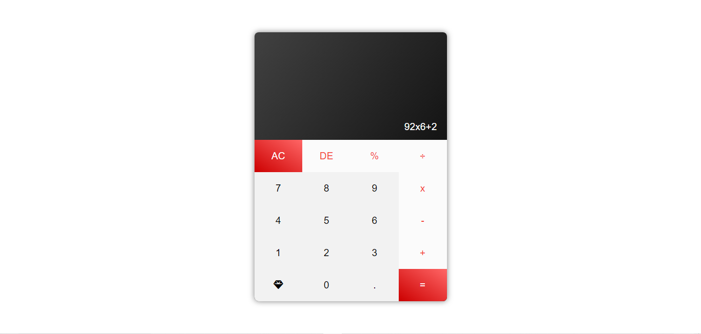

# Simple Calculator 



A simple calculator web application built using HTML, CSS, and JavaScript.

## Live Demo

Check out the live demo: [Calculator](https://chauhan-hardik.github.io/Calculator/)

## Features

- Arithmetic operations: Addition (+), Subtraction (-), Multiplication (x), Division (÷), and Modulus (%).
- AC button: Clears the display.
- DE button: Deletes the last entered digit or operator.
- Equal (=) button: Evaluates the expression and displays the result.
- Error handling: If an invalid expression is entered, the display shows an "Error" message, and buttons are disabled until AC or DE is pressed.
- Hover effects: Visual feedback on button hover for non-touchscreen devices.
- Responsive design: Adjusts layout for mobile devices.

## Technologies Used

- HTML
- CSS
- JavaScript

## External Libraries

- Font Awesome: Used for icon.

## Installation

1. Clone the repository to your local machine:

   ```bash
   git clone https://github.com/chauhan-hardik/Calculator.git

## Contributing

Feel free to contribute by opening issues or submitting pull requests.

---

**Note:** The calculator app is a simple project for educational purposes and may not cover all edge cases. Use it responsibly and at your own risk.
